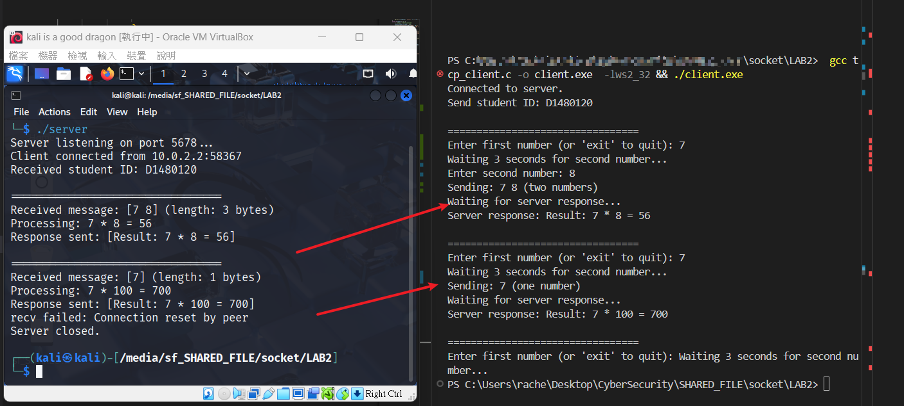
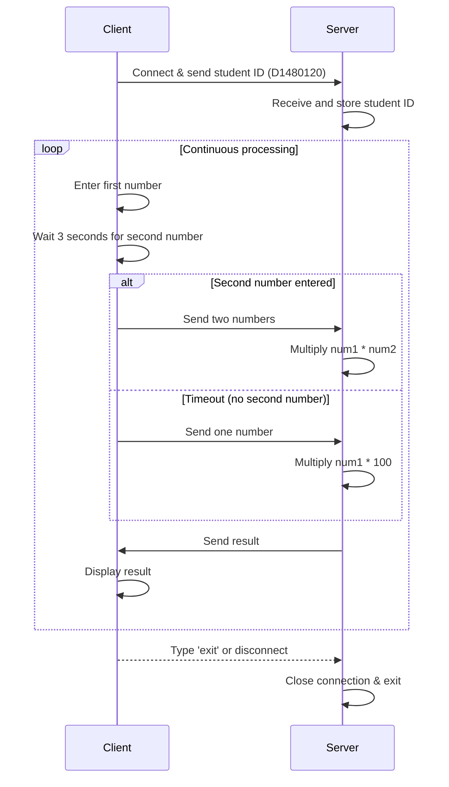

### Program Overview

#### Info
- Protocol: TCP
- Language: C
- Server Platform: VirtualBox VM - Linux kali 6.12.25-amd64
- Client Platform: Microsoft Windows11 [10.0.26100.6584]
- IP & Port: Server: 10.0.2.15, Client: 127.0.0.1, Port: `5678`

#### Setup
`tcp_client.c` -> `gcc tcp_client.c -o tcp_client.exe -lws2_32 && ./tcp_client.exe`
`tcp_server.c` -> `gcc tcp_server.c -o server && ./server`

#### Result Preview

#### Program Flow

