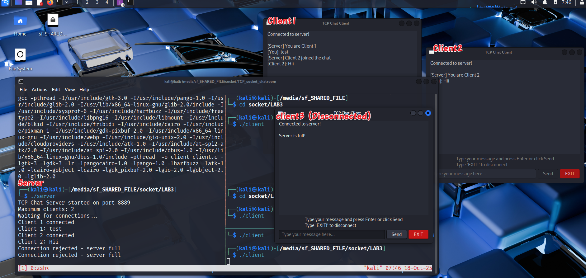
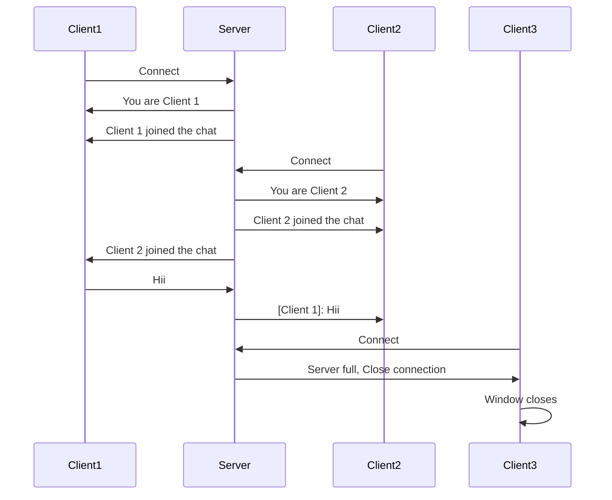
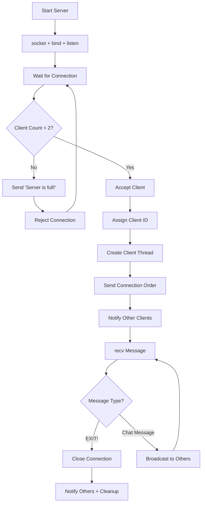
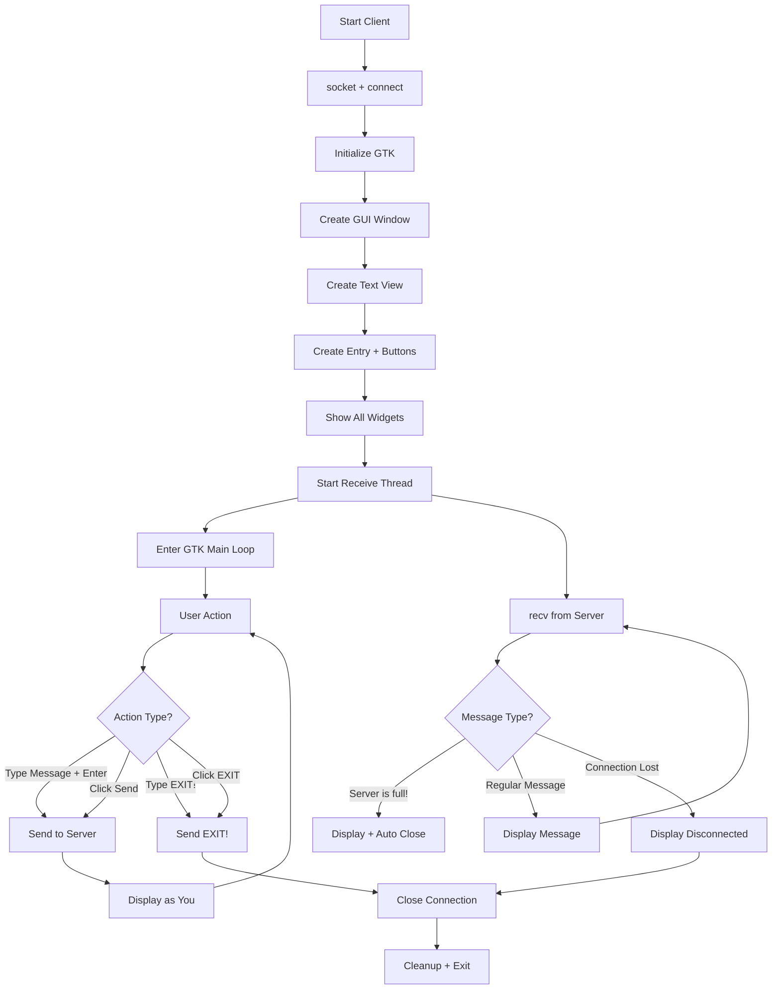

# TCP Simple Chat System with GTK GUI

### Program Overview

#### Info
- Protocol: TCP
- Language: C
- Server Platform: VirtualBox VM - Linux Kali 6.12.25-amd64
- Client Platform: VirtualBox VM - Linux Kali 6.12.25-amd64
- IP & Port: Local, `8889`

#### Setup
Since we are using pthread, we need `-pthread` while compiling

**Server:**
```bash
gcc -pthread -o server server.c
./server
```

**Client:**
```bash
gcc -pthread $(pkg-config --cflags gtk+-3.0) -o client client.c $(pkg-config --libs gtk+-3.0)
./client [server_ip]
```

Or simply use:
```bash
make
./server
./client
```

---

## Program Flow




---

## Code Overview

### Server Key Functions (`server.c`)

1. **Structure Definition**
   - `Client` struct contains: socket, id, active status
   - Global array `clients[MAX_CLIENTS]` for managing connections
   - `pthread_mutex_t` for thread-safe operations

2. **`broadcast_message()`**
   - Use `mutex_lock` and `unlock` to safely access client array
   - Send message to all active clients except sender
   - Format: `[Client X]: message`

3. **`handle_client()`**
   - Each client runs in separate pthread
   - Send connection order: "You are Client X"
   - Notify other clients when someone joins
   - Message handling:
     - Check for EXIT! command
     - Broadcast regular messages to all other clients
   - Disconnection handling:
     - Mark client slot as inactive
     - Notify remaining clients
     - Close socket and exit thread

4. **Main Loop**
   - Accept incoming connections
   - Check if server is full (max 2 clients)
   - If full: send "Server is full!" and reject
   - If available: create new client thread



### Client Key Functions (`client.c`)

Using: **GTK+ 3.0** for GUI, **pthreads** for networking

1. **Initialization**
   - Create TCP socket and connect to server
   - Initialize GTK (`gtk_init`)
   - Create GUI components:
     - Main window
     - Scrolled text view (chat display)
     - Entry field (message input)
     - Send button and EXIT button
   - Connect signal handlers for buttons and keyboard

2. **`append_text_idle()`**
   - Insert text to GUI text buffer using GTK API
   - Auto-scroll to bottom (`gtk_text_view_scroll_to_mark`)
   - Free allocated memory

3. **`append_text()`**
   - Thread-safe wrapper using `g_idle_add()`
   - Schedules `append_text_idle()` to run in GTK main thread

4. **`receive_messages()`**
   - Background thread continuously receives from server
   - Handle special messages:
     - "Server is full!" triggers disconnect
     - Regular messages appended to display
   - On disconnect: notify user and close window

5. **`send_message()`**
   - Read text from entry field
   - Send to server via socket
   - Handle EXIT! command
   - Echo own message to display as "[You]: message"
   - Clear entry field

6. **Button Handlers**
   - `on_exit_button_clicked`: Send EXIT! and close
   - `on_window_destroy`: Clean up socket and quit GTK



---

## Commands

| Command | Description |
|---------|-------------|
| `EXIT!` | Disconnect from server |
| Any other text | Send as chat message |

