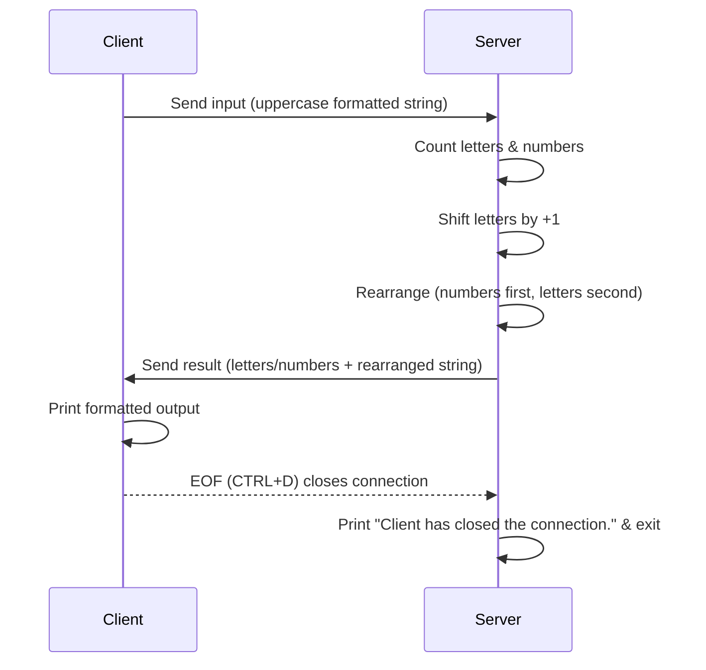
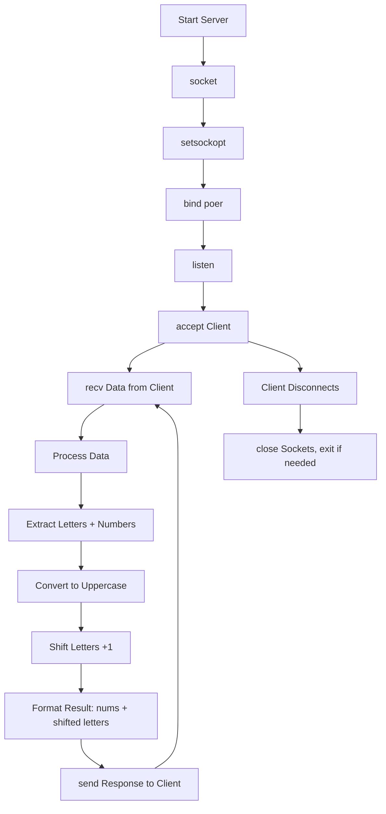
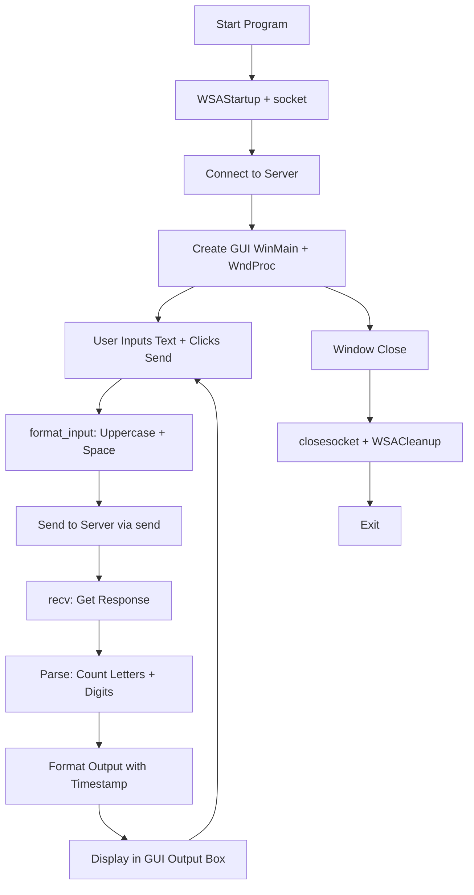

### Program Overview

#### Info
- Protocal: TCP
- language: C
- Server Platform: VirtualBox VM - Linux kali 6.12.25-amd64
- Client Platform: Microsoft Windows11 [10.0.26100.6584]
- IP & port: local, `5678`
#### Setup
`client.c`-> `gcc client.c -o client.exe  -lws2_32 && ./client.exe`
`server.c` -> `gcc server.c -o server && ./server`

#### Result Preview


#### Program Flow



---

## 🛠️ Code Overview

### Server Key Functions

1. **Startup**  
   - Create a TCP socket (`socket`)  
   - Enable port reuse (`setsockopt`)  
   - Bind to port `5678` (`bind`)  
   - Start listening for connections (`listen`)  

2. **Client Connection**  
   - Accept an incoming client (`accept`)  
   - Log connection with client’s IP/port and timestamp  

3. **Data Handling**  
   - Wait for messages from client (`recv`)  
   - Separate **letters** and **numbers**  
   - Convert letters to uppercase  
   - Apply **shift by +1** (A→B, B→C, …, Z→A)  

4. **Formatting**  
   - Numbers are grouped as `[1 2 3]`  
   - Letters are grouped as `[F J I W I]`  
   - Shifted letters grouped as `[G K J X J]`  
   - Final combined format example:  
     ```
     1 1 3 G K J X J
     ```

5. **Response**  
   - Send final formatted string back to the client (`send`)  
   - Keep processing until client disconnects  

6. **Shutdown**  
   - On disconnection, close sockets and clean up       



### Client Key Functions

using: WinSock2 and the Win32 API.

1. Startup

- Initialize Winsock
- Create a TCP socket
- Connect to the server

2. GUI Initialization

- Create main window and child controls (input box, send button, output area).

1. **Startup**  
   - Initialize Winsock (`WSAStartup`)  
   - Create a TCP socket (`socket`)  
   - Connect to the server (`connect`)  

2. **GUI Initialization**  
   - Create main window and child controls (input box, send button, output area).  
   - Message loop (`GetMessage`, `DispatchMessage`) keeps GUI responsive.  

3. **User Action**  
   - User enters text and presses **Send** button.  

4. **Data Handling**  
   - Input text → converted to **uppercase letters with spaces** (`format_input`).  
   - Client sends formatted string to the server.  

5. **Server Response**  
   - Client receives processed text back from the server.  
   - Client counts the number of **letters** and **digits** separately.  
   - Results formatted as `"letters: X numbers: Y => [nums] and [letters]"`.  

6. **Display**  
   - Append results to output box with **timestamp**.  
   - User can continue sending more text until window is closed.  


