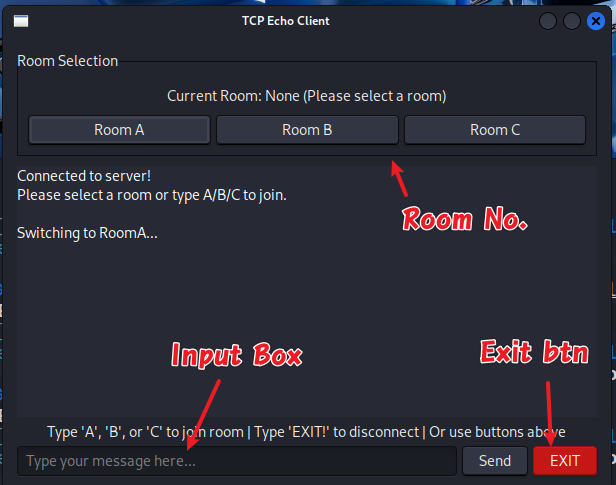
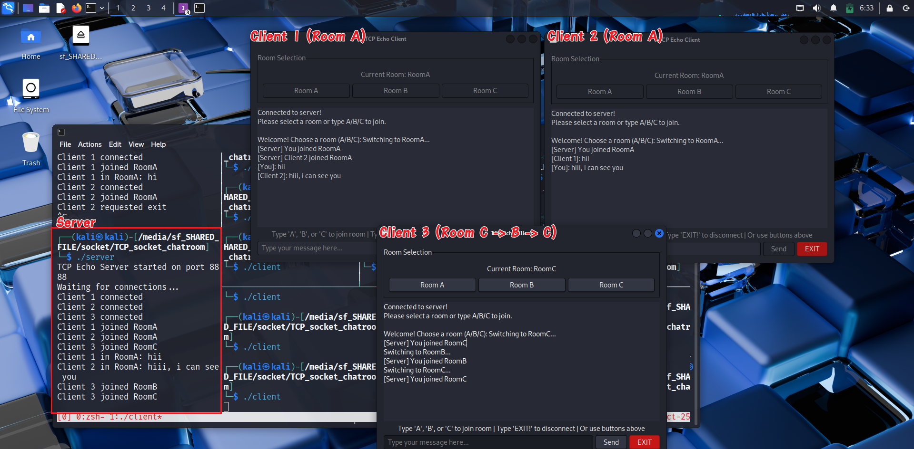
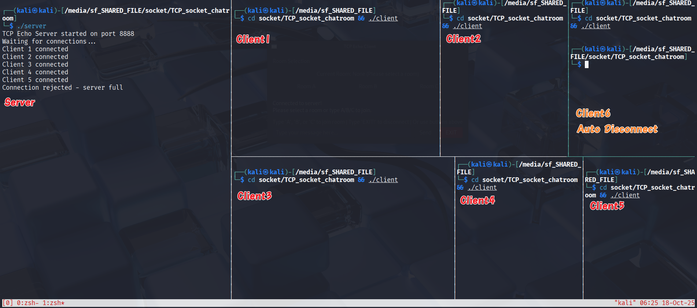
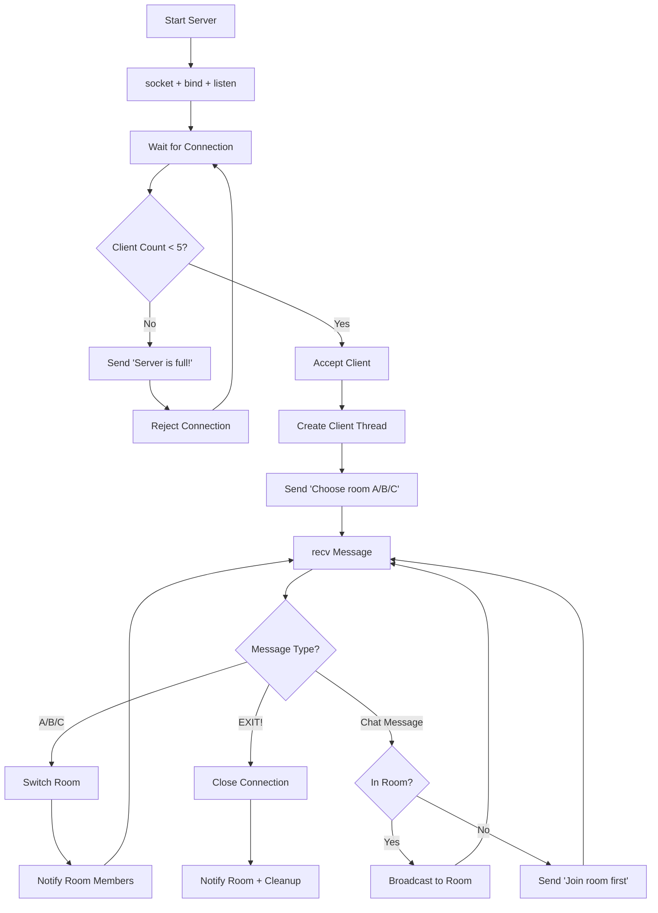

# TCP Multi-Room Chat System with GTK GUI

### Program Overview

#### Info
- Protocol: TCP
- Language: C
- Server Platform: VirtualBox VM - Linux Kali 6.12.25-amd64
- Client Platform: VirtualBox VM - Linux Kali 6.12.25-amd64

#### Setup
since we are using pthread, we need `-pthread` while compiling
**Server:**
```bash
gcc -pthread -o server server.c
./server
```

**Client:**
```bash
gcc -pthread $(pkg-config --cflags gtk+-3.0) -o client client.c $(pkg-config --libs gtk+-3.0)
./client [server_ip]
```

Or simply use:
```bash
make
./server
./client
```
---

## Testing Result and GUI preview
Client GUI overview

Server and client GUI overview

Only allow 5 client to connect


---

## Code Overview

### Server Key Functions (`server.c`)

1. Define Structure `Clients`
- since we define each client;s room, activee stagtement, socket id, we may easily managing and target the client to send correspond message

2. `broadcast_to_room()`
   - using `mutex_lock` and `unlock` to send message to each client form server

3. `broadcast_to_all()`
   - using `mutex_lock` and `unlock` to send message to each client form server


3. `handle_client()`
   - Every new client will create a new thread
   - Input handling:
      - check EXIT statement
      - check room changing and updtae the `clients` struct
      - send message to the client's room
   - EXIT handling(Disconnection)
      - Notify room members when client leaves
      - Free client slot in array
      - Decrement active client count
      - Close socket and exit thread



### Client Key Functions (`client.c`)

Using: **GTK+ 3.0** for GUI, **pthreads** for networking

1. INIT
   - Create TCP socket (`socket`)
   - Connect to server IP:port (`connect`)
   - Initialize GTK (`gtk_init`)
      - Create main window (`gtk_window_new`)
      - Room selection buttons
      - Chat display
      - Send button + EXIT button
      - Connect signal handlers for buttons and keyboard

2. `append_text_idle()`
   - using GTK API to insert text to the GUI display
   - auto scrolling to the buttom(`gtk_text_view_scroll_to_mark`)
   - free thread

3. `append_text`
   - using `g_idle_add()` to set thread and execute `append_text_idle()`

4.   `update_room_label()`
   - update room and echo

5. `receive_messages()`
   - receive message from server and do actions like `append_text`

6. `send_message()`
   - string compare and call functions

7. `on_XX_button_clicked`
   - handle button actions

##### Commands

| Command | Description |
|---------|-------------|
| `A` | Join RoomA |
| `B` | Join RoomB |
| `C` | Join RoomC |
| `EXIT!` | Disconnect from server |
| Any other text | Send as chat message |

---

## Architecture

### Server Design
- **Single-threaded accept loop** for new connections
- **Multi-threaded client handlers** (one pthread per client)
- **Shared state protection** via `pthread_mutex`
- **Room-based routing** for message isolation

### Client Design
- **Main thread**: GTK event loop + UI rendering
- **Background thread**: Blocking `recv()` for messages
- **Thread-safe updates**: `g_idle_add()` for GUI modifications
- **Non-blocking UI**: Network operations don't freeze interface
