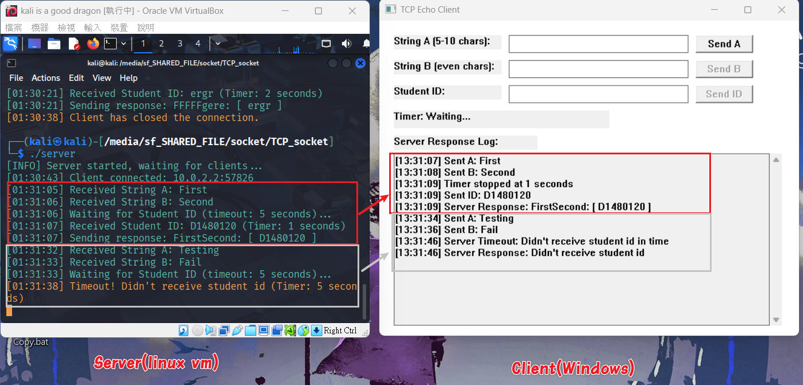

### Program Overview

#### Info
- Protocal: TCP
- language: C
- Server Platform: VirtualBox VM - Linux kali 6.12.25-amd64
- Client Platform: Microsoft Windows11 [10.0.26100.6584]
- IP & port: local, `5678`
#### Setup
`client.c`-> `gcc client.c -o client.exe  -lws2_32 && ./client.exe`
`server.c` -> `gcc server.c -o server && ./server`

#### Result Preview

#### Program Flow

---

## Code Overview

### Server Key Functions

1. **Startup**
   - Create a TCP socket (`socket`)
   - Enable port reuse (`setsockopt`)
   - Bind to port `5678` (`bind`)
   - Start listening for connections (`listen`)

2. **Client Connection**
   - Accept an incoming client (`accept`)
   - Log connection with client's IP/port and timestamp

3. **Server main process**
    1. Receive **String A** from client
    2. Receive **String B** from client
    3. Wait for **Student ID** with **5-second timeout**
     - Start timer to track elapsed time
     - Use `select()` with 5-second timeout to wait for data
     - Record elapsed time when data arrives or timeout occurs

4. **Timer's Setting**
   - **case 1: Student ID received within 5 seconds**:
     - Form response: `String A + String B + ": [ Student ID ]"`
     - Example: `"FirstSecond: [ D1480120 ]"`

   - **case 2: timeout occurs (5 seconds elapsed)**:
     - Send: `"Didn't receive student id"`
     - client reset button status and log the output

### Client Key Functions

Using: **WinSock2** and **Win32 API** for Windows GUI

1. **Startup**
   - Initialize Winsock (`WSAStartup`)
   - Create a TCP socket (`socket`)
   - Connect to the server (`connect`)

2. **GUI Initialization**
   
   - Message loop (`GetMessage`, `DispatchMessage`) keeps GUI responsive

3. **Sequential Input Validation & Sending**

   **Step 1: Send String A**
   - Validate: Length must be 5-10 characters (`validate_string_a`)
   - If invalid: Show error message, wait for correct input
   - If valid: Send to server, disable "Send A" button, enable "Send B" button

   **Step 2: Send String B**
   - Validate: Character count must be even (`validate_string_b`)
   - If invalid: Show error message, wait for correct input
   - If valid:
     - Send to server
     - Disable "Send B" button, enable "Send ID" button
     - **Start Timer 1**: Display timer (updates every 100ms)
     - **Start Timer 2**: Check for server timeout response (every 5 seconds)

   **Step 3: Send Student ID**
   - Validate: not empty
   - If invalid: Show error message
   - If valid:
     - Stop both timers, log elapsed time
     - Send to server
     - Receive server response
     - Display response in log
     - Reset to initial state (ready for next round)

4. **Timeout Handling**
   - If user doesn't send Student ID within 5 seconds:
     - **CheckTimeoutResponse()** detects server's timeout message
     - Display: `"Didn't receive student id"`
     - Automatically reset to initial state

5. **Reset Function** (`ResetToInitial`)
   - Stop all timers
   - Clear all input fields
   - Re-enable "Send A" button only
   - Disable "Send B" and "Send ID" buttons
   - Reset timer display to "Timer: Waiting..."
